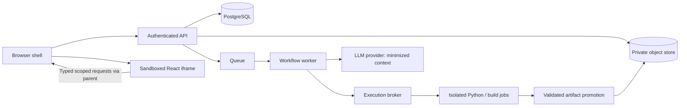

# Architecture

Status: local API, PostgreSQL metadata/migrations, operator-issued authentication, owner-scoped project APIs, runtime preflight, and React bridge lab exist. Queue, analysis, artifact storage, and hosted services remain planned. See [persistence/auth](PERSISTENCE_AND_AUTH.md).

## Service responsibilities

| Component | Proposed technology | Responsibility |
| --- | --- | --- |
| Web application | React, TypeScript, Vite | Authenticated shell, upload/configuration, run history, reports |
| API | FastAPI, Pydantic, SQLAlchemy/Alembic | Ownership, validation, upload streaming, run commands, SSE, artifact access |
| Orchestrator worker | LangChain tools + LangGraph | Persistent stage graph, provider calls, budget accounting, artifact validation |
| Queue | Redis + Celery, proposed | Delivery, concurrency, worker leases; PostgreSQL remains run-status source of truth |
| Metadata/checkpoints | PostgreSQL | Users/projects, datasets, run state, events, checkpoints, audit records |
| Object store | Private S3-compatible storage | Immutable uploads and versioned generated artifacts |
| Execution broker | Small internal service | Issue isolated Python/build jobs; stage scoped inputs; enforce limits |
| Python runtime | Linux sandbox with gVisor or evaluated microVM service | Parse untrusted files and run generated analysis with no network or secrets |
| UI build runtime | Separate isolated job | Compile allowlisted React source with preinstalled dependencies |
| Renderer | Separate untrusted-content site + sandboxed iframe | Display compiled component using scoped data messages |

## Flow and trust boundaries



The browser, model, generated source, uploaded databases, and job outputs are untrusted. Only application-controlled services authorize resource access. The execution broker alone may control runtimes; API and workflow workers have no Docker socket. Runtime jobs receive read-only local input files, never object-store credentials. A trusted collector copies bounded outputs after job exit and rejects symlinks, path traversal, unexpected types, and excessive artifact counts/sizes.

## Reliability model

The API creates a run and outbox event in one transaction. A dispatcher delivers the outbox message to the queue with at-least-once semantics. Workers claim a lease, checkpoint after validated stages, and heartbeat. Each stage attempt has an ID and private staging prefix; publication uses a transaction checking the current run generation and cancellation marker. Duplicate deliveries inspect committed stage results and do not repeat published work. A sweeper requeues expired leases within retry budgets.

SSE events use monotonically increasing per-run sequence numbers. Reconnection replays from `Last-Event-ID`; expired event history triggers a current-state snapshot. A failed SSE connection does not stop the run. Provider calls cannot always be deduplicated; track attempts and reserve budget before dispatch.

## Local and hosted profiles

Windows development uses WSL2/Linux tooling where necessary. Ordinary container execution is a trusted-fixture development profile only and is explicitly labeled as insufficient for hostile public workloads. Until the hardened runtime passes its proof of concept, generated-code execution is disabled outside that profile. Managed hosting must support separate workers and runtime controls; do not assume a frontend serverless platform can execute these workloads.

## Planned repository layout

Current frontend code is in `packages/renderer-bridge` and `tests/renderer-lab`, the security harness. `apps/web` and `apps/renderer` will hold product surfaces when those milestones begin. Backend foundation code follows the service paths below.

```text
apps/web/                  authenticated React shell
apps/renderer/             isolated dashboard host
services/api/              REST/SSE and migrations
services/worker/           graph nodes and queue tasks
services/execution-broker/ runtime adapters and job policy
packages/contracts/        generated TS types and JSON schemas
packages/dashboard-kit/    approved chart/filter components
sandbox/python/            pinned Python execution image
sandbox/ui-build/          pinned offline compiler image
tests/fixtures/            synthetic CSV/SQLite inputs
tests/security/            adversarial integration tests
infra/                     development/deployment definitions
docs/                      specifications and decisions
memory/                    project continuity
```

Do not create placeholder implementations that imply the system is working. Pin exact package/runtime versions and lockfiles at scaffolding, after compatibility checks. Use a provider adapter so model choice is configuration rather than scattered SDK calls.
